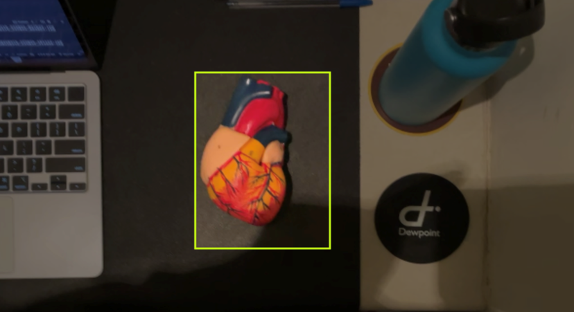
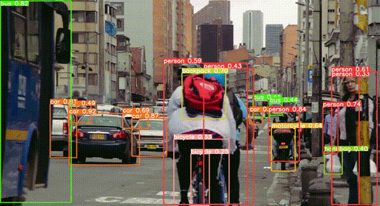
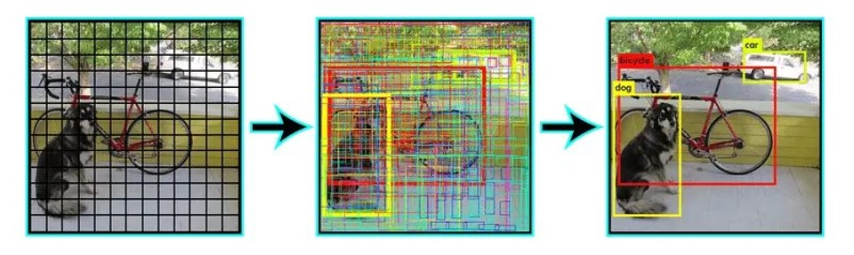

# Immersive Mixed-Reality Heart Anatomy Lab

An advanced **mixed-reality educational tool** designed to teach human heart anatomy through **Apple Vision Pro**. Built using **Unity PolySpatial**, **YOLOv8 object detection**, and **AI-powered self-assessment**, this project enables fully immersive and hands-free learning for **medical students and faculty**.

> ⚠️ Note: At the request of the project owner, the full source code cannot be made publicly available.  
> This repository focuses on demonstrating key features and interaction design.  
> Thank you for your understanding.


## 📌 Features

✅ **Spatial Learning** – Use Vision Pro gestures and gaze to navigate interactive 3D content.  
✅ **3D Heart Model** – High-fidelity, scalable anatomy model precisely aligned with a physical heart replica.  
✅ **Object Detection** – Real-time alignment between virtual and physical models using a Roboflow-trained YOLOv8 ONNX pipeline.  
✅ **AI Chatbot** – Voice/text Q&A powered by OpenAI GPT 3.5 and Whisper for hands-free assistance.  
✅ **Self-Assessment** – Embedded quizzes (9 lessons, 2 quiz types) with instant feedback and scoring.  
✅ **Offline Mode** – Full functionality without internet connection after deployment.  
✅ **Native AVP Deployment** – Runs natively on Apple Vision Pro with PolySpatial optimizations.

<br><br>


## 🎥 Video Demo

<p align="center">
  <a href="https://youtu.be/TDhGBHax9co" target="_blank">
    
  </a><br><em>Click the image above to watch the demo video on YouTube.</em>
</p>
<br><br>


## 🛠️ Installation & Deployment

### Prerequisites  
- Apple Vision Pro device + VisionOS SDK license  
- macOS on Apple Silicon (M1+)  
- Unity **6000.0.34f1** with **PolySpatial** and **Barracuda**  
- Xcode **15.2+**  
- Unity Education License  
- Python 3.9+ (for ONNX model conversion)

### Setup Steps

1. **Clone the repository**  
   ```bash
   git clone https://github.com/your-repo-name/ImmersiveHeartLab.git
   cd ImmersiveHeartLab
   ```
2. **Import into Unity**  
   - Open in Unity Hub, ensure PolySpatial & Barracuda packages are installed.  
   - (Optional) Configure Firebase for analytics in `Assets/Config/FirebaseConfig.json`.
3. **Prepare Object Detection Model**  
   - Convert your trained YOLOv8 `.pt` to ONNX via provided script:  
     ```bash
     python tools/convert_to_onnx.py --weights models/heart_yolov8.pt --output models/heart_yolov8.onnx
     ```
4. **Build & Deploy to AVP**  
   - Switch Build Target to VisionOS in Unity Editor.  
   - Export Xcode project via PolySpatial UMP.  
   - In Xcode, set the same Wi-Fi network and Apple ID provisioning, then run on connected AVP.

<br><br>

## 🚀 Usage

### For Medical Students

1. Wear the Vision Pro headset and launch the **Heart Anatomy Lab** app.  
2. Navigate through **9 structured lessons** covering chambers, valves, vessels, and conduction system.  
3. Interact with the **3D model**: detach, rotate, highlight specific parts using hand gestures.  
4. Launch quizzes at the end of each module for **self-assessment** (multiple-choice & labeling).  
5. Ask questions verbally or via gaze to AI Chatbot for on-demand explanations.

### For Faculty

- **Content Manager**: Upload custom quizzes and lesson content via the `Content/Editor` tool.  
- **Analytics Dashboard**: Review student performance metrics and quiz scores offline.  
- **Customization**: Extend to other organs by plugging in new 3D assets and detection markers.

<br><br>

## ⚙️ Technical Architecture

1. **Vision Pro + Unity PolySpatial**: Core runtime for rendering and spatial interactions.  
2. **YOLOv8 ONNX**: Real-time detection pipeline integrated via Unity Barracuda.  
3. **AI Layer**: Whisper ASR captures voice, GPT 3.5 responds; hosted locally in-app for offline.

<br><br>

## 🧪 Testing & Validation

- **User Testing**: Validated by WMU medical faculty & students across simulation and physical model alignment.  
- **Performance**: Maintains **60 FPS** in simulation; object detection latency <100 ms.  
- **Feedback**: Faculty rated usability & learning efficacy at **4.8/5** in pilot studies.  
- **Limitations**: Real-device camera access currently simulated due to AVP permission constraints.

<br><br>

## 🧠 Object Detection with YOLOv8

We implemented real-time object detection to track the physical heart model using YOLOv8 and Roboflow.  
This enables spatial alignment between the virtual 3D model and the real-world heart replica.

<p align="center">
  
</p>

Training was conducted on over 2,300 labeled images.  
The model achieved **95% precision & recall**, enabling reliable alignment and detection in mixed-reality settings.

<p align="center">
  
</p>
<p align="center">
  
</p>
<br><br>

## 📦 Project Size & Constraints

- **Total Build**: ~9 GB (includes all assets & detection model).  
- **Offline First**: No runtime internet dependency; initial licensing required.  
- **Permissions**: AVP camera access pending special license—fallback to simulation mode.
<br><br>


## 📜 License

Distributed under the MIT License. See `LICENSE` for details.
